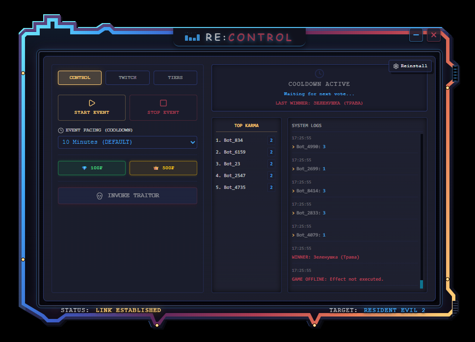
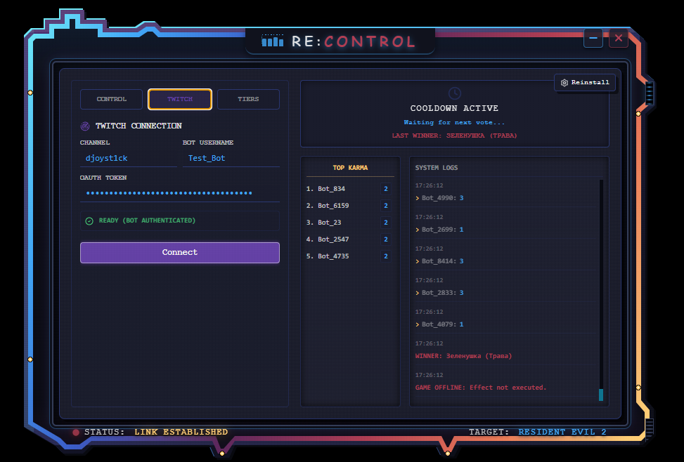
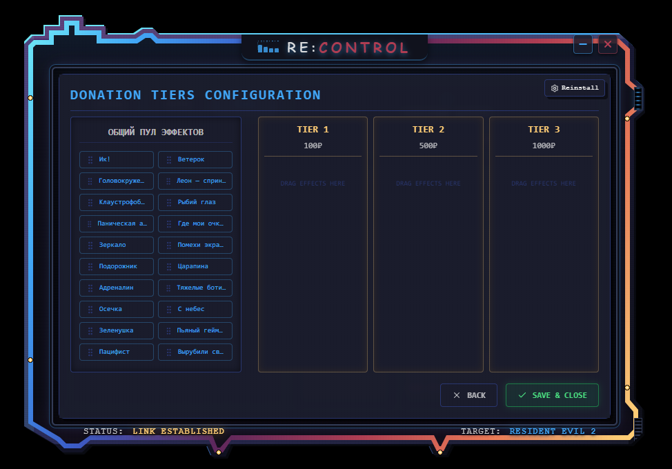
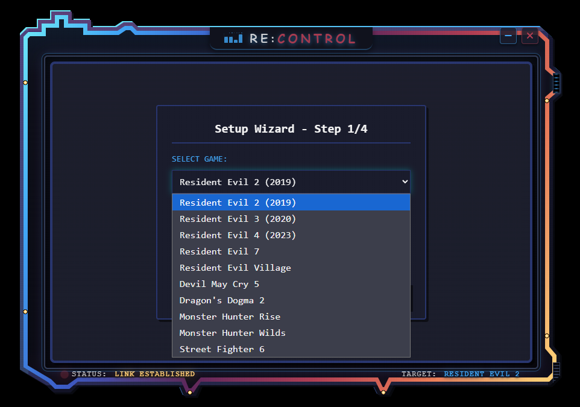



  <h1>RE:CONTROL</h1>
  
<strong>Next-Gen Interactive Twitch Integration for Resident Evil</strong>

  
  
  
  

 

**RE:CONTROL** — это приложение, которое превращает зрителей вашего Twitch-канала в полноправных ИИ-Режиссеров. Оно связывает чат трансляции и движок Resident Evil (через REFramework), позволяя зрителям голосовать, донатить и применять десятки эффектов прямо в игре без задержек.

---

## ✨ Ключевые возможности

- 🗳️ **Демократический Хаос (Голосования):** Каждые N минут чат голосует за один из 3 случайных эффектов. Победивший эффект мгновенно применяется к Итану/Леону по UDP.
- 💀 **Режим Предателя (Traitor Mode):** Эксклюзивная механика для сабов и VIP-зрителей. "Предатель" выбирается случайным образом и получает право обрушить хаос на стримера в обход голосования.
- 💎 **Интеграция Донатов (DonationAlerts):** Донаты автоматически триггерят премиум-эффекты вне очереди (VIP-очередь).
- ⚙️ **Drag-and-Drop Конфигуратор:** Удобный полноэкранный интерфейс управления пулом эффектов и настройкой ценовых категорий (Tiers) для донатов.
- 🏆 **Система Кармы:** Встроенная SQLite база данных отслеживает активность зрителей и формирует лидерборд самых коварных участников.
- 📺 **OBS Оверлей:** Встроенный локальный WebSocket сервер (ws://localhost:27016) отдает красивые неоновые виджеты голосований прямо в ваш OBS (Browser Source).

## 📸 Скриншоты интерфейса

| Панель управления (Control) | Настройка Twitch |
| :---: | :---: |
|  |  |

| Конфигуратор Эффектов (Tiers) | Мастер установки (Setup Wizard) |
| :---: | :---: |
|  |  |

## 🛠️ Технический стек

- **Фронтенд:** React, TypeScript, TailwindCSS, Framer Motion
- **Бэкенд:** Electron (Node.js), SQLite, UDP Sockets, WebSocket (ws)
- **Игровой мост:** REFramework (Lua скрипты)

## 🚀 Установка и запуск

1. **Склонируйте репозиторий:**
   `ash
   git clone https://github.com/Djoystick/RE-Control.git
   cd RE-Control
   `
2. **Установите зависимости:**
   `ash
   npm install
   `
3. **Запустите в режиме разработки:**
   `ash
   npm run dev
   `

## 🗺️ Roadmap (Дорожная карта)

- [x] **Фаза 1:** MVP (Мост с игрой, Базовый UI, Парсинг Twitch)
- [x] **Фаза 2:** Уникальные механики (Карма, Предатель, 22 эффекта на Lua)
- [x] **Фаза 3.2:** OBS Overlay (React Browser Source)
- [x] **Фаза 3.3:** Интеграция донатов (Приоритетная очередь эффектов)
- [x] **Фаза 3.5:** Полноэкранный Конфигуратор эффектов (Drag-and-Drop)
- [ ] **Фаза 4:** Поддержка RE4 / RE3 Remake, Публичное API для плагинов

## 📝 Лицензия
Создано Djoystick & Antigravity.

